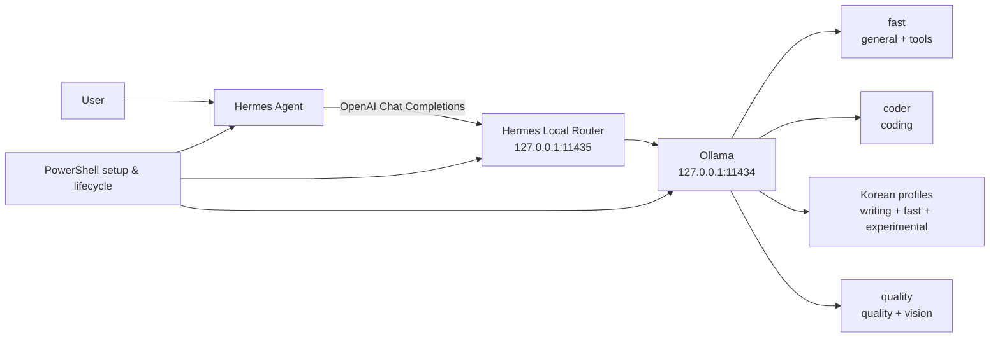

# Hermes Local Router for Windows

[한국어](README.md) · [English](README.en.md)

[](https://github.com/sinmb79/hermes-local/actions/workflows/ci.yml)
[](LICENSE)
[](SECURITY.md)

An OpenAI-compatible router that connects
[Hermes Agent](https://github.com/NousResearch/hermes-agent) on Windows to local
[Ollama](https://ollama.com/) models and selects a role-specific model for each
request.

This repository contains no model weights. Its Modelfiles only reference model
distribution paths. Downloads happen directly on each user's computer after
the user runs an installation command.

## Why it is useful

- Keep the LLM inference path on `127.0.0.1` while retaining Hermes tool calls.
- Route general work, coding, Korean writing, and quality/vision requests
  through one `hermes-auto` endpoint.
- Start with one approximately 13GB `Core` model instead of being forced to
  install all six.
- Use PowerShell commands for lifecycle management, config backup, health
  checks, and real Hermes end-to-end verification.
- Test the pure-standard-library Python router against a fake Ollama server,
  with no model download in CI.

## Architecture



The router considers images, code signals, Korean text ratio, and tool
requirements. It only tries a fallback model for transient upstream failures;
invalid 4xx requests are not repeated across models.

## Requirements

- Windows 10/11 and Windows PowerShell 5.1 or newer
- [Ollama for Windows](https://ollama.com/download/windows)
- [Hermes Agent native Windows installation](https://github.com/NousResearch/hermes-agent/blob/main/website/docs/user-guide/windows-native.md)
- Git
- A 16GB-class memory setup is recommended for `Core`. CPU offloading may work
  but can be much slower.

Hermes agent tools require a 64K context setting. The aliases in this project
use `num_ctx 65536`, so KV-cache memory is needed in addition to model memory.

## Five-minute start

```powershell
git clone https://github.com/sinmb79/hermes-local.git
Set-Location .\hermes-local
Set-ExecutionPolicy -Scope Process Bypass

# Default: download gpt-oss:20b directly to this computer and configure it
.\Setup-Hermes-Local.ps1

# Launch
.\Start-Hermes.ps1
```

The configuration step first creates a timestamped backup of the existing
Hermes `config.yaml`. To inspect paths without automatically downloading a
model, split the process:

```powershell
# Check referenced paths and installed models; a missing model produces guidance.
.\Install-Hermes-Models.ps1 -Preset Core

# A download starts only when the user explicitly runs this command.
.\Install-Hermes-Models.ps1 -Preset Core -PullMissing
```

## Presets

| Preset | Roles downloaded | Approx. storage | Use |
|---|---|---:|---|
| `Core` | fast | ~13GB | General queries and tools |
| `Developer` | fast + coder | ~32GB | Local coding agent |
| `Korean` | fast + Mi:dm + A.X | ~29GB | Korean writing and fast structure |
| `Full` | all six | ~88GB | Vision, quality, and experimental profiles |

Sizes may change as tags and quantizations are updated.

```powershell
.\Setup-Hermes-Local.ps1 -Preset Developer
.\Setup-Hermes-Local.ps1 -Preset Korean

# Run only after reading and accepting the Kanana License
.\Setup-Hermes-Local.ps1 -Preset Full -AcceptKananaLicense
```

The experimental Kanana profile is not part of the default installation.
Review [third-party notices](THIRD_PARTY_NOTICES.md) first because its license
has conditional commercial terms and attribution requirements.

## Role models

| Role | Hermes alias | Referenced model | Public default capability |
|---|---|---|---|
| Fast general/tools | `hermes-fast` | `gpt-oss:20b` | text, tools |
| Coding | `hermes-coder` | `qwen3-coder:30b` | text, tools |
| Quality/vision | `hermes-quality` | `qwen3.6:35b` | text, vision, tools |
| Korean writing | `hermes-korean-writing` | Mi:dm 2.0 Q6 | text |
| Korean fast | `hermes-korean-fast` | A.X 4.0 Light Q6 | text |
| Korean experimental | `hermes-korean-agent` | Kanana 2 Q4 | text, experimental |

Mi:dm, A.X, and Kanana reference GGUF distributions on Hugging Face. Each model
has its own license; the repository's MIT license does not cover model weights.

## Common commands

```powershell
.\Start-Hermes-Services.ps1
.\Test-Hermes-Local.ps1 -Preset Core -Generation
.\Hermes-Local-Settings.ps1
.\Restart-Hermes-Services.ps1
.\Stop-Hermes-Services.ps1

# Real Hermes one-shot call; terminal tool verification is explicitly opt-in.
.\Test-Hermes-E2E.ps1
.\Test-Hermes-E2E.ps1 -IncludeTool
```

See the [operations guide](docs/OPERATIONS.en.md) and
[routing design](docs/DESIGN.en.md) for details.

## Security boundary

- Ollama and the router are restricted to loopback addresses.
- Router logs do not contain raw prompts or response bodies.
- Loopback is not authentication; another process on the same computer can
  access a local port.
- Enabling Hermes web, Telegram, shell, or other external tools can separately
  access networks or modify local files.
- Personal `.env` files, Hermes configs, conversations, logs, and model weights
  are not tracked and are blocked by the public-release check.

See [SECURITY.md](SECURITY.md) for vulnerability reporting.

## Verification

```powershell
$env:PYTHONDONTWRITEBYTECODE = "1"
python -m unittest discover -s tests -p "test_*.py" -v
.\scripts\Test-PowerShellSyntax.ps1
python .\scripts\check_public_release.py
```

The initial public export came from a configuration that passed 20 router
contract tests plus real Hermes response and terminal-tool checks. CI never
downloads models; it validates contracts, syntax, privacy, and documentation
links.

## Known limitations

- Operational scripts are Windows-only.
- The quality 35B model and a 64K KV cache require substantial RAM/VRAM.
- Upstream model tags, Hermes configuration keys, and Ollama behavior can
  change.
- Optional tool schemas are removed for Korean text-only profiles.
- Model output accuracy and safety are not guaranteed.

The reference validation date is 2026-07-30, using Hermes Agent 0.15.1 and
Ollama 0.32.5.

## License

Code and documentation in this repository are under the [MIT License](LICENSE).
Hermes Agent, Ollama, every model, and each GGUF distribution retain their own
licenses. Read [THIRD_PARTY_NOTICES.md](THIRD_PARTY_NOTICES.md).

This is an independent community project. It is not an official project of,
or endorsement by, Nous Research, Ollama, OpenAI, Qwen, KT, SK Telecom, or
Kakao.
