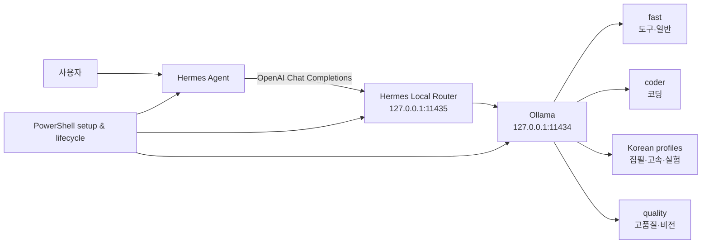

# Hermes Local Router for Windows

[한국어](README.md) · [English](README.en.md)

[](https://github.com/sinmb79/hermes-local/actions/workflows/ci.yml)
[](LICENSE)
[](SECURITY.md)

Windows의 [Hermes Agent](https://github.com/NousResearch/hermes-agent)를
[Ollama](https://ollama.com/) 로컬 모델에 연결하고, 요청 성격에 따라 역할별
모델을 자동 선택하는 OpenAI 호환 라우터입니다.

모델 가중치는 이 저장소에 없습니다. 저장소에는 공식/제3자 배포 경로를
가리키는 Modelfile만 있으며, 사용자가 설치 명령을 실행할 때 각자의 PC로
직접 내려받습니다.

## 왜 쓸모 있나요?

- Hermes의 도구 호출을 유지하면서 LLM 추론 경로를 `127.0.0.1` 안에 둘 수
  있습니다.
- 일반 작업, 코딩, 한국어 집필, 고품질·비전 작업을 하나의
  `hermes-auto` 주소로 라우팅합니다.
- 한 번에 6개 모델을 강제 설치하지 않습니다. 약 13GB의 `Core`부터
  시작해 필요한 역할만 추가할 수 있습니다.
- 시작·중지·상태 확인·설정 백업·실제 Hermes 호출 검증을 PowerShell
  명령으로 제공합니다.
- 라우터는 Python 표준 라이브러리만 사용하며, 모델 없이도 가짜 Ollama
  서버를 이용한 계약 테스트를 실행할 수 있습니다.

## 구조



라우터는 이미지, 코드 단서, 한국어 비율, 도구 요구 여부를 보고 모델을
선택합니다. 일시적인 upstream 오류에만 제한적으로 대체 모델을 시도하며,
잘못된 요청(HTTP 4xx)은 다른 모델에 반복 전송하지 않습니다.

## 준비물

- Windows 10/11 및 Windows PowerShell 5.1 이상
- [Ollama for Windows](https://ollama.com/download/windows)
- [Hermes Agent Windows 설치](https://github.com/NousResearch/hermes-agent/blob/main/website/docs/user-guide/windows-native.md)
- Git
- `Core` 기준 16GB급 메모리 실행 환경 권장. CPU 오프로딩도 가능하지만
  훨씬 느릴 수 있습니다.

Hermes의 에이전트 도구 사용에는 64K 문맥 설정이 필요합니다. 이 프로젝트의
별칭은 `num_ctx 65536`을 사용하므로 모델 크기 외에 KV 캐시 메모리도
필요합니다.

## 5분 시작

```powershell
git clone https://github.com/sinmb79/hermes-local.git
Set-Location .\hermes-local
Set-ExecutionPolicy -Scope Process Bypass

# 기본: gpt-oss:20b 하나를 사용자 PC로 내려받고 연결
.\Setup-Hermes-Local.ps1

# 실행
.\Start-Hermes.ps1
```

설정 과정은 기존 Hermes `config.yaml`을 타임스탬프가 붙은 파일로 먼저
백업합니다. 모델을 자동으로 받지 않고 경로만 확인하려면 다음처럼 나누어
실행하십시오.

```powershell
# 모델 경로와 설치 여부만 검사합니다. 누락 시 다운로드 명령을 안내합니다.
.\Install-Hermes-Models.ps1 -Preset Core

# 사용자가 명시적으로 실행할 때만 실제 다운로드가 시작됩니다.
.\Install-Hermes-Models.ps1 -Preset Core -PullMissing
```

## 설치 프리셋

| 프리셋 | 내려받는 역할 | 대략적 저장공간 | 용도 |
|---|---|---:|---|
| `Core` | fast | 약 13GB | 일반 질의와 도구 호출 |
| `Developer` | fast + coder | 약 32GB | 로컬 코딩 에이전트 |
| `Korean` | fast + Mi:dm + A.X | 약 29GB | 한국어 집필·빠른 구조화 |
| `Full` | 전체 6종 | 약 88GB | 비전·품질·실험 모델 포함 |

크기는 태그와 양자화 업데이트에 따라 달라집니다.

```powershell
.\Setup-Hermes-Local.ps1 -Preset Developer
.\Setup-Hermes-Local.ps1 -Preset Korean

# Kanana License를 읽고 동의한 사용자만 실행
.\Setup-Hermes-Local.ps1 -Preset Full -AcceptKananaLicense
```

`Full`의 Kanana 프로필은 실험용이며 기본 설치에 포함되지 않습니다.
조건부 상업 이용 조항과 표시 의무가 있으므로
[제3자 고지](THIRD_PARTY_NOTICES.md)를 먼저 확인하십시오.

## 역할별 모델

| 역할 | Hermes 별칭 | 참조 모델 | 공개 기본 능력 |
|---|---|---|---|
| 빠른 일반·도구 | `hermes-fast` | `gpt-oss:20b` | text, tools |
| 코딩 | `hermes-coder` | `qwen3-coder:30b` | text, tools |
| 고품질·비전 | `hermes-quality` | `qwen3.6:35b` | text, vision, tools |
| 한국어 집필 | `hermes-korean-writing` | Mi:dm 2.0 Q6 | text |
| 한국어 고속 | `hermes-korean-fast` | A.X 4.0 Light Q6 | text |
| 한국어 실험 | `hermes-korean-agent` | Kanana 2 Q4 | text, experimental |

Mi:dm, A.X, Kanana는 Hugging Face의 GGUF 배포 경로를 참조합니다. 모델마다
라이선스가 다르며 프로젝트의 MIT 라이선스가 모델 가중치에 적용되는 것은
아닙니다.

## 자주 쓰는 명령

```powershell
.\Start-Hermes-Services.ps1
.\Test-Hermes-Local.ps1 -Preset Core -Generation
.\Hermes-Local-Settings.ps1
.\Restart-Hermes-Services.ps1
.\Stop-Hermes-Services.ps1

# 실제 Hermes 단발 호출. terminal 도구 검증은 명시적으로 켭니다.
.\Test-Hermes-E2E.ps1
.\Test-Hermes-E2E.ps1 -IncludeTool
```

전체 운영·복구 방법은 [운영 가이드](docs/OPERATIONS.md), 라우팅 계약은
[설계 문서](docs/DESIGN.md)를 보십시오.

## 보안 경계

- Ollama와 라우터는 loopback 주소만 허용합니다.
- 라우터 로그는 프롬프트 원문이나 응답 본문을 기록하지 않습니다.
- loopback은 인증이 아닙니다. 같은 PC의 다른 프로세스는 로컬 포트에
  접근할 수 있습니다.
- Hermes에서 웹, Telegram, shell 등 외부 도구를 켜면 그 도구는 별도로
  외부 통신하거나 로컬 파일을 변경할 수 있습니다.
- 개인 `.env`, Hermes 설정, 대화 기록, 로그, 모델 가중치는 Git 추적
  대상이 아니며 공개 검사에서 차단됩니다.

취약점 신고 방법은 [SECURITY.md](SECURITY.md)를 확인하십시오.

## 검증

```powershell
$env:PYTHONDONTWRITEBYTECODE = "1"
python -m unittest discover -s tests -p "test_*.py" -v
.\scripts\Test-PowerShellSyntax.ps1
python .\scripts\check_public_release.py
```

초기 공개판은 라우터 계약 테스트 20개와 실제 Hermes 일반 응답·terminal
도구 호출을 통과한 구성에서 분리했습니다. CI는 모델을 다운로드하지 않고
계약·구문·개인정보·문서 링크만 검증합니다.

## 알려진 제약

- Windows 전용 운영 스크립트입니다.
- 고품질 35B 모델과 64K KV 캐시는 상당한 RAM/VRAM을 요구합니다.
- 모델 태그, Hermes 설정 키, Ollama 동작은 upstream 업데이트로 바뀔 수
  있습니다.
- 한국어 text 전용 프로필에서는 선택적 도구 스키마를 제거합니다.
- 생성 결과의 정확성·안전성은 보장되지 않습니다.

참조 검증일은 2026-07-30이며 Hermes Agent 0.15.1, Ollama 0.32.5에서
확인했습니다.

## 라이선스

이 저장소의 코드와 문서는 [MIT License](LICENSE)입니다. Hermes Agent,
Ollama, 각 모델과 GGUF 배포물에는 각자의 라이선스가 적용됩니다.
[THIRD_PARTY_NOTICES.md](THIRD_PARTY_NOTICES.md)를 반드시 확인하십시오.

이 프로젝트는 Nous Research, Ollama, OpenAI, Qwen, KT, SK Telecom 또는
Kakao의 공식 프로젝트가 아니며 어떠한 보증·제휴도 뜻하지 않습니다.
